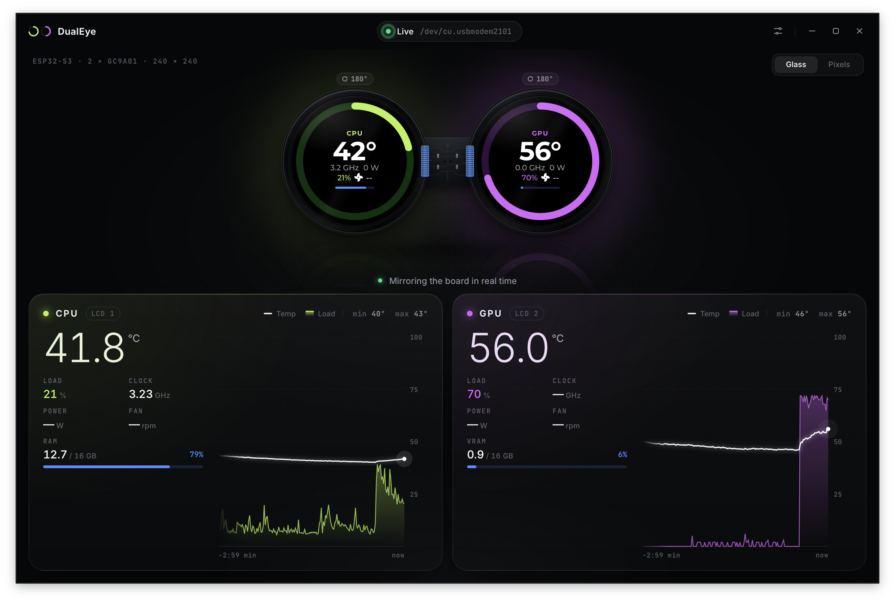
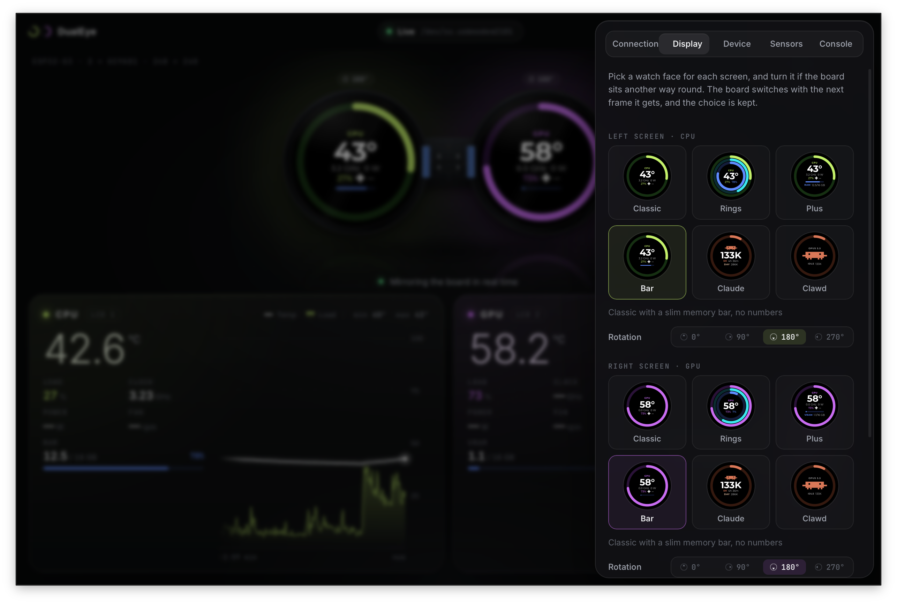

# ESP32-S3 DualEye PC Monitor


Turn the **ESP32-S3 DualEye** (two 240×240 round displays) into a desk companion for your PC: CPU and GPU temperatures, load, fans and memory, plus your Claude Code usage with its mascot, on Apple Watch–style faces you pick per screen. Say "Alexa" and it listens, carries out what you ask and answers out loud, all on your own computer.

<p align="center">
  
</p>

<p align="center">
  
</p>

## What's new in 1.0

- **A voice assistant.** Say "Alexa", then ask in Italian or English: change a face, dim the screens, turn them upside down, ask how hot the GPU is or what time it is. The board does it and answers out loud. It keeps listening for a few seconds after answering, so you can carry on without the wake word, and you can interrupt it by saying "Alexa" again. Nothing you say leaves your computer: see [Privacy](#privacy).
- **Claude can drive the board.** Claude Code and Claude Desktop can change faces, show a message ("build done!") or speak through the board, via the [MCP server](#control-it-from-claude) built into the app.
- **Screen rotation.** Mount the board upside down or on its side and turn each screen to match.
- **The board remembers.** Faces, rotation, brightness and volume are kept on the board, which boots showing them even before the app starts.
- **A roomier app.** The settings panel is wider and can be dragged wider still; it now has a Voice tab that says which models suit your computer and downloads them for you.
- **Clearer downloads.** Every installer says which system it is for (see below).

## Install

Download the app for your system from the [latest release](https://github.com/EttoreCaputo/esp32s3-dualeye-pcmonitor/releases/latest). The firmware for the board is inside it.

| System | File |
|--------|------|
| Windows | `DualEye_<version>_windows-x64-setup.exe` (or the `.msi`) |
| Mac with Apple Silicon (M1 and later) | `DualEye_<version>_macos-apple-silicon.dmg` |
| Mac with Intel | `DualEye_<version>_macos-intel.dmg` |
| Linux | `DualEye_<version>_linux-x64.AppImage`, `.deb` or `.rpm` |

Then plug the board in by USB and open the app. It finds the board on its own, and if the board runs an older firmware it offers to update it. A new board, or one running something else, can be flashed from Settings → **Device**.

**First launch.** The app isn't code-signed yet, so the system warns the first time:

- **macOS:** open the app once, then allow it in **System Settings → Privacy & Security → Open Anyway**, or run `xattr -cr /Applications/DualEye.app`.
- **Windows:** on "Windows protected your PC", click **More info** → **Run anyway**.
- **Linux:** to reach the board, add yourself to the `dialout` group once: `sudo usermod -aG dialout "$USER"`, then log out and back in.

Closing the window keeps the app running in the tray, so the screens stay live.

## Watch faces

Each screen shows one of ten faces, chosen independently in Settings → **Display**; any face goes on either screen:

| Face | Shows |
|------|-------|
| `classic` | Temperature, clock, power, fan RPM; load on the ring (the default) |
| `rings` | Three rings, outside in: load, temperature (cyan, orange from 80 °C, red from 90 °C), memory |
| `plus` | Classic, plus a RAM (CPU) or VRAM (GPU) bar with GiB used/total; orange from 90 % |
| `bar` | Classic with a slimmer RAM/VRAM bar, no numbers |
| `claude` | Claude Code: 5-hour limit used on the outer ring, weekly limit on the inner ring (orange from 80 %, red from 95 %), time to the 5-hour reset, and a small Clawd |
| `clawd` | Claude Code's mascot, large and animated: walks while Claude works, blinks when idle, sleeps after 30 min |
| `net` | Download speed in large and on the outer ring, upload on the inner ring; the rings scale to the last minute's peak (firmware 1.1) |
| `disk` | The system disk: space used on the ring (orange from 90 %), used/total, reads and writes per second where the OS reports them (firmware 1.1) |
| `battery` | The laptop's charge on the ring (orange below 20 %, red below 10 % on battery), whether it's charging, and the time to empty or to full; "No battery" on a desktop (firmware 1.1) |
| `image` | A picture or an animated GIF of your own (firmware 1.1, see below) |

The first four show the CPU or the GPU: by default the CPU on the left screen and the GPU on the right one, but **Shows** under each screen switches it, so both screens can show the GPU, or the CPU can go on the right.

### Your own pictures

Pick **Image** for a screen, then **Choose…** a PNG, JPEG, WebP, BMP or animated GIF. The app crops it to the middle square, scales it to 240 × 240 and sends it to the board, which keeps it in its flash (4 MB per screen) and shows it even with the app closed. Animations play at up to 20 frames a second; a long one is thinned until it fits. **Remove** takes it off.

In the same tab you can turn each screen by 0°, 90°, 180° or 270° if the board sits another way round; the app's mirror stays upright and marks a turned screen with a badge.

### Claude Code faces

The Claude faces work out of the box: the app counts the tokens in Claude Code's transcripts on this computer (`~/.claude/projects`) and notices when Claude is working. To see your plan's 5-hour and weekly limits too (Pro and Max), press **Connect status line** in Settings → **Display**. It points Claude Code's status line at the app, keeping a backup of your settings (`settings.json.dualeye-backup`) and still printing your previous status line; **Disconnect** puts it back.

### Claude alerts

The board can also tell you what Claude Code is up to, so you can leave it working and step away from the screen:

- **Claude needs you**: it's waiting for a permission or has asked you a question.
- **Claude is done**: it finished a task that took at least 30 s (or 1, 2, 5 min).
- **Limits**: your 5-hour or weekly limit passed 80 % or 95 % (needs the status line above). The 5-hour one also says when it resets.

The eyes react (surprised, happy, suspicious), the message shows over the watch face for 10 s and, with voice on and **Answer out loud**, the board says it in Italian or English. An alert waits for a voice conversation to end before it plays.

Press **Connect hooks** in Settings → **Display** → **Claude alerts**. It adds the app to Claude Code's hooks (`UserPromptSubmit`, `Stop` and `Notification`) in `~/.claude/settings.json`, keeping your own hooks and a backup. The hooks run in the background, so Claude never waits on them, and they do nothing while the app is closed. **Try it** plays a sample alert; **Disconnect** removes only DualEye's hooks. Claude Code sessions that were already open may need a restart to pick the hooks up.

## Voice assistant

Say **"Alexa"** to the board, then a command in Italian or English: *"metti la faccia rings a sinistra"*, *"put classic on the right screen"*, *"abbassa la luminosità al 30 per cento"*, *"make your voice louder"*, *"gira gli schermi sottosopra"*, *"scrivi ciao a tutti"*, *"how hot is the GPU?"*, *"che ore sono?"*. The board does it and answers out loud, in the language you spoke.

### Getting started

In the app, open Settings → **Voice**:

1. Turn on **Transcribe what the board hears**.
2. Under **This computer** the app says what it found (processor, memory, GPU) and which models suit it; **Use …** picks them and downloads what's missing (about 3 GB for the default pair, once).
3. Press **Install Piper**, the program that speaks the answers (about 100 MB, once), and download a voice for each language (the defaults are ticked).
4. Say "Alexa", wait for the cyan eyes, and talk.

### Talking to it

After the wake word the screens turn into two animated eyes (the app's mirror shows them too) that tell you what the board is doing:

| Eyes | Meaning |
|------|---------|
| Cyan, wide open, glancing around and growing with your voice | Listening: after the wake word, and for 4 s after each answer |
| Amber, looking up from side to side, one eye squinting | Thinking: your words are being transcribed and understood |
| Green, smiling and bobbing with the speaker's level | Speaking |
| Red and sad, with a shake and two falling notes | Something failed, or no words were heard; say "Alexa" again |

They close and the watch faces come back when the conversation ends. While nobody is talking they also come out on their own every minute or two for a few seconds (a wink, a yawn, a look around, a dizzy spin...); turn off **Let the eyes play now and then while idle** in the Voice tab (firmware 1.0.2) to keep the faces still. Turn off **Show animated eyes while talking** in the Voice tab (firmware 1.0.1) for a ring round the faces instead, in the same colours: cyan with an arc that follows your voice, amber turning, green with the speaker's level, red.

- **Follow-ups.** After an answer the board keeps listening for 4 s, so *"e anche a destra"* or *"a bit more"* works straight away; the last exchanges are remembered for 3 minutes. Turn it off with **Keep listening after an answer**.
- **Interrupting.** Say "Alexa" while the board talks: it stops and listens.
- **Wake word, mic and volume.** Choose "Alexa" or "Hi ESP", mute the mic, and set the speaker's volume; the board remembers all three.
- **Without a language model** (turned off, or not downloaded) a few fixed phrases still work: faces, screens, brightness, rotation, volume, temperatures and the time.

On an M1 Pro the answer starts about 1.5 s after you stop talking (2–3 s when something changes on the board).

### Which computer it needs

The app picks the models from the hardware it finds:

| Computer | Speech model | Language model | Answers |
|----------|--------------|----------------|---------|
| Apple silicon, 16 GB or more | `small` | `qwen3-4b-2507` | Fast |
| Apple silicon, 8 GB | `small` | `qwen3.5-2b` | Fast |
| NVIDIA card with 5 GB or more (CUDA build of llama.cpp, see [below](#voice-internals)) | `small` | `qwen3-4b-2507` | Fast |
| No usable GPU, 8 GB and 4 cores or more | `base` | `qwen3.5-2b` | A few seconds |
| Less | `base` | none (fixed phrases) | |

The language model stays loaded while voice is on: about 3 GB of memory for `qwen3-4b-2507`, 1.5 GB for `qwen3.5-2b`.

### Privacy

Nothing you say leaves your computer. There is no account, no cloud service and no telemetry.

- **The board** only listens for the wake word on its own; before it, nothing is sent. Muting the mic stops even that.
- **Audio** goes over USB to the app, is kept in memory until it is transcribed, then dropped. It is written to disk only if you turn on **Keep recordings** (for debugging).
- **Transcripts and answers** are shown in the Voice tab (the last 50) and forgotten when the app quits.
- **Speech recognition, the language model and the voice** run as local programs reachable from this computer only (`127.0.0.1`).
- **The network** is used only to download what you ask for: models from Hugging Face (checked against a SHA-256), Piper from PyPI, and Python the first time the app flashes the board.

### Troubleshooting

| Problem | What to do |
|---------|------------|
| The eyes (or the ring) don't appear when you say "Alexa" | Check the mic isn't muted, and speak from 1–2 m, towards the board. The Voice tab's Board status shows `idle` when it's listening for the wake word |
| The eyes appear, then turn red | No words were heard (too far, too quiet), or a helper failed: the Voice tab shows the error under the status |
| "Speech-to-text: Not working" | The Whisper model isn't downloaded, or whisper-server couldn't start: see `whisper-server.log` in the [data folder](#where-the-app-keeps-its-files)'s `models/` |
| "Language model: Not working" | The model isn't downloaded, or doesn't fit in memory: pick the recommended one, or a smaller one. `llama-server.log` is next to the models. Meanwhile the fixed phrases answer |
| "Text-to-speech: Not working" | Piper isn't installed, or no voice is downloaded for a language. Reinstall it from the Voice tab |
| Answers are slow | The Voice tab shows the time of each step. Use the recommended models; on a computer without a GPU, `base` and `qwen3.5-2b` |
| The board wakes up by itself | Try "Hi ESP" instead |
| The wrong words come out | Set the language instead of Auto |

## Control it from Claude

The app includes an [MCP](https://modelcontextprotocol.io) server, so Claude Code or Claude Desktop can use the board: ask Claude to "put the rings face on the left", "show *build done* on the board" or "say the tests passed".

Settings → **Display** → **MCP server** shows the command for this computer, with Copy buttons, and how many clients are connected. On macOS:

```bash
claude mcp add --scope user dualeye -- /Applications/DualEye.app/Contents/MacOS/dualeye-app --mcp
```

For Claude Desktop, add the same command to `claude_desktop_config.json` (Settings → Developer → Edit Config) and restart it:

```json
{ "mcpServers": { "dualeye": { "command": "/Applications/DualEye.app/Contents/MacOS/dualeye-app", "args": ["--mcp"] } } }
```

| Tool | From | Does |
|------|------|------|
| `set_face`, `set_rotation`, `set_brightness`, `show_text`, `set_mic`, `set_wake_word`, `set_volume`, `set_eyes`, `play_eyes`, `get_state` | Board | Passed through as the firmware describes them ([docs/protocol.md](docs/protocol.md#board-tools)); a newer firmware's tools show up without a host update |
| `get_metrics` | Host | CPU and GPU temperature, load, clock, power, memory, fans |
| `get_claude_usage` | Host | Claude Code tokens in the 5-hour window and today, plan limits used, time to reset, working or idle |
| `speak` | Host | Says a short text out loud through the board, in Italian or English; needs the app with spoken replies on, or `dualeye --tts`, running |

Changes made this way show up in the app. It works with the app closed too: the server then opens the board's port for each call.

## Where the app keeps its files

| | macOS | Windows | Linux |
|---|---|---|---|
| Settings, voice models and logs | `~/Library/Application Support/dualeye` | `%APPDATA%\dualeye` | `~/.config/dualeye` |
| esptool, for flashing | `~/Library/Application Support/com.dualeye.monitor/esptool` | `%LOCALAPPDATA%\com.dualeye.monitor\esptool` | `~/.local/share/com.dualeye.monitor/esptool` |

The voice models are in `models/` (with `whisper-server.log` and `llama-server.log`), recordings, when kept, in `voice/`, and a copy of each screen's picture, for the app's mirror, in `images/`.

---

Everything below is for working on the source or using the command line.

## Command line

`dualeye` is the same bridge as the app, without the window. Install Rust from [rustup.rs](https://rustup.rs), then close `idf.py monitor` (it holds the same port) and run:

```bash
cd host
cargo run --release              # auto-detects the board (USB 303a:xxxx) and streams
cargo run --release -- --once    # print one snapshot, no serial
cargo run --release -- --sensors # every raw sensor the backends can see
cargo run --release -- --cpu-face rings --gpu-face plus
cargo run --release -- --cpu-rotation 180 --gpu-rotation 180   # board upside down
cargo run --release -- tools                                      # the board's tools
cargo run --release -- call set_face --screen left --face rings
cargo run --release -- call show_text --text "Ciao!" --seconds 5
cargo run --release -- --cpu-face rings --cpu-source gpu         # the GPU on the left screen too
cargo run --release -- image cat.gif --screen right               # a picture for the image face
cargo run --release -- call set_face --screen right --face image
cargo run --release -- mcp                                        # MCP server on stdio
cargo run --release -- --help
```

The binary ends up in `host/target/release/dualeye` (`dualeye.exe` on Windows) and has no runtime dependencies. `tools` and `call` use the board's tools (firmware 0.4 or later); while the app or a streaming `dualeye` runs they go through it, otherwise they open the port for the call and close it right after. With the CLI on your `PATH`, `claude mcp add --scope user dualeye -- dualeye mcp` registers it with Claude Code.

When the bridge connects it adopts the faces and rotation stored on the board (so a change made over MCP while the app was closed sticks); the CLI pushes its own instead when you pass any face or rotation flag.

Voice from the command line:

```bash
brew install whisper-cpp llama.cpp               # or tools/build_sidecars.sh, or DUALEYE_*_SERVER
dualeye models                                   # the models, and which suit this computer
dualeye models download small                    # speech-to-text, about 490 MB
dualeye --stt                                    # print each transcript
dualeye piper install                            # Piper, in a virtualenv in DualEye's data folder (needs Python 3.9+)
dualeye models download it_IT-paola-medium       # Italian voice, 64 MB
dualeye models download en_GB-alba-medium        # English voice, 63 MB
dualeye --stt --tts                              # spoken answers, fixed phrases
dualeye models download qwen3-4b-2507            # the language model, 2.5 GB
dualeye --stt --tts --llm                        # ...understood by the language model
dualeye ask "metti rings a sinistra"             # type a command instead of saying it
dualeye eval                                     # the eval set on a simulated board
dualeye say "Ciao!"                              # speak through the running app or dualeye --tts
dualeye call set_wake_word --word hiesp          # "Hi ESP" instead of "Alexa"
dualeye call set_mic --muted true
```

`--stt` takes a model from `dualeye models` or a ggml file, `--stt-language it|en` skips language detection, `--voice-dump` keeps each utterance as a WAV file, `--llm` takes a model or a GGUF file, `--llm-gpu-layers 0` keeps it on the CPU, `--tts-voice ID` picks another voice for its language, and `--no-follow-up` turns off listening after an answer.

### What each OS provides

| Data | Linux | Windows | macOS |
|------|-------|---------|-------|
| CPU load | ✓ | ✓ | ✓ |
| CPU clock | ✓ | ✓ | Apple Silicon: IOReport (the real average clock; sysinfo only gives the maximum); Intel: ✓ |
| CPU temp (avg of all CPU sensors) | hwmon: coretemp, k10temp, zenpower | ACPI thermal zone (run as admin; many boards report nothing) | SMC (per-core keys for each chip generation, M1–M5; a core that powers down keeps its last reading, and the average is smoothed over ~2 s), else IOHID |
| CPU power | RAPL (see below) | — | Apple Silicon: `powermetrics` through the app's system helper (see below), else IOReport `Energy Model`; on macOS 27, which freezes its CPU counter for apps without Apple's entitlement, the SMC SoC rail (`PZC0`) minus the GPU's power |
| NVIDIA GPU (temp, load, clock, power, fan RPM) | NVML | NVML | — |
| AMD GPU | hwmon `amdgpu` | — | — |
| Mac GPU (temp, load, memory, clock, power) | — | — | SMC temperatures (per-generation keys on Apple Silicon, `TG*` on Intel), IOAccelerator; clock and power from IOReport on Apple Silicon |
| Fans | hwmon (`cpu` = fastest board fan, `gpu` = fastest GPU fan) | — | SMC `F<n>Ac` (`cpu` = fastest fan; MacBook fans stop at 0 RPM when cool) |
| RAM | ✓ | ✓ | ✓ |
| VRAM | NVML, `amdgpu` (`mem_info_vram_*`) | NVML | IOAccelerator (Apple Silicon: GPU share of the unified RAM) |

The sensors are read straight from the OS, with no CoolerControl or other daemon. Missing values are just left out of the snapshot; the board shows what it gets.

**Linux, CPU power:** `energy_uj` is root-only since the RAPL side-channel fix (CVE-2020-8694). To show package power anyway, make it world-readable at boot:

```bash
echo 'z /sys/class/powercap/intel-rapl:0/energy_uj 0444 - - -' | sudo tee /etc/tmpfiles.d/dualeye-rapl.conf
```

```bash
sudo systemd-tmpfiles --create /etc/tmpfiles.d/dualeye-rapl.conf
```

**macOS, CPU power:** macOS 27 lets only Apple's `powermetrics`, run as root, read the CPU's energy counters; other apps get an estimate. For the exact value, turn on **Settings → Sensors → Exact CPU power** in the installed app and allow DualEye in System Settings → General → Login Items & Extensions. That registers `dualeye-power-helper` ([host/dualeye-power-helper](host/dualeye-power-helper)), a LaunchDaemon inside the app bundle (`SMAppService`), which runs `powermetrics` while the app or the CLI is connected and serves its CPU, GPU and ANE power on `/var/run/com.dualeye.monitor.power.sock`. It sends data only to code signed by the same team, takes no input, and turning the switch off removes it. Registering needs the app signed by a team (an Apple Development or Developer ID certificate, `APPLE_SIGNING_IDENTITY`); an ad-hoc build can't. The CLI uses the helper too when it's signed by the same team.

## Building from source

**Stack:** ESP-IDF ≥ 5.4 (CI uses v6.1) · [lvgl/lvgl](https://components.espressif.com/components/lvgl/lvgl) `9.3.0` · [espressif/esp_lcd_gc9a01](https://components.espressif.com/components/espressif/esp_lcd_gc9a01) `^2.0.4` · [espressif/esp-sr](https://components.espressif.com/components/espressif/esp-sr) · Rust (sysinfo, nvml-wrapper, serialport, rmcp) · [Tauri 2](https://v2.tauri.app/) + Svelte

### Repository layout

```
main/                     firmware (ESP-IDF component: display, LVGL UI, metrics parser, audio, wake word)
build/merged-binary.bin   firmware image the desktop app flashes (the only tracked file in build/)
version.txt               firmware version, built into the image
FIRMWARE_CHANGELOG.md     what each firmware version changes, shown by the app's update offer
.github/workflows/        release pipeline
sdkconfig.defaults        firmware config (target esp32s3, 16 MB flash, USB Serial/JTAG console)
partitions.csv            flash layout: app, then the ESP-SR `model` partition
.devcontainer/            ESP-IDF container for VS Code
tools/build_sidecars.sh   builds whisper-server and llama-server for the app bundle
host/                     Cargo workspace
  dualeye-core/           library: sensors, Claude Code usage, snapshot, serial bridge, esptool setup/flash,
                          voice (STT, language model agent and its eval set, fixed phrases, TTS)
  dualeye-cli/            `dualeye` command-line bridge
  dualeye-app/            desktop app: Svelte UI in src/, Tauri shell in src-tauri/
```

### Prerequisites

| Part | Needs |
|------|-------|
| Firmware | [ESP-IDF](https://docs.espressif.com/projects/esp-idf/en/stable/esp32s3/get-started/) ≥ 5.4, or the dev container in `.devcontainer/` |
| CLI | [Rust](https://rustup.rs) ≥ 1.85 (edition 2024) |
| Desktop app | Rust, [Node.js](https://nodejs.org) ≥ 20.19, plus the platform packages below |

Desktop app, per platform (once):

- **Linux (Debian/Ubuntu):**

  ```bash
  sudo apt install -y libwebkit2gtk-4.1-dev libgtk-3-dev libsoup-3.0-dev libjavascriptcoregtk-4.1-dev libayatana-appindicator3-dev librsvg2-dev build-essential
  ```

  Other distros: see [Tauri's prerequisites](https://v2.tauri.app/start/prerequisites/).
- **Windows:** [Visual Studio Build Tools](https://visualstudio.microsoft.com/visual-cpp-build-tools/) with "Desktop development with C++" and the Rust MSVC toolchain. WebView2 ships with Windows 10/11.
- **macOS:** `xcode-select --install`.

### Firmware

```bash
idf.py set-target esp32s3   # first time only
idf.py build
idf.py -p /dev/ttyACM0 flash monitor
```

To update the image the desktop app ships, merge bootloader, partition table and app into one file and commit it:

```bash
idf.py merge-bin            # writes build/merged-binary.bin
```

`.gitignore` ignores `build/` except that file. The app embeds it at compile time (`include_bytes!` in `host/dualeye-app/src-tauri/src/lib.rs`), so rebuild the app afterwards; the build warns when a file in `main/` is newer than the image.

To release a new firmware: bump `version.txt`, add its `## <version>` section to `FIRMWARE_CHANGELOG.md` (the release pipeline fails without it), and rebuild the image. The firmware prints its version as `{"dualeye":"1.0.0","idf":"v6.1"}` at boot; the app compares it with the image it carries and, when the board's is older, shows the changelog sections in between and offers the update.

### CLI

```bash
cd host
cargo build --release       # host/target/release/dualeye
```

Plain `cargo` commands in `host/` only touch `dualeye-core` and `dualeye-cli` (the workspace's default members), so they work without the GUI packages.

### Desktop app

```bash
cd host/dualeye-app
npm install
npm run dev                 # UI only, in a browser, with synthetic data: no board or Rust needed
npm run tauri dev           # the real app, hot reload on UI changes
npm run tauri build         # release build + installers
```

On macOS, `tauri dev` and `tauri build` first build the power helper (`tools/build_power_helper.sh`, from `src-tauri/tauri.macos.conf.json`); with the voice sidecars, use `--config src-tauri/tauri.sidecars.macos.conf.json` there instead of `tauri.sidecars.conf.json`, since it lists all three.

`npm run tauri build` packages for the OS it runs on (Tauri does not cross-compile), into `host/target/release/bundle/`:

| Built on | Output |
|----------|--------|
| Linux | `deb/*.deb`, `rpm/*.rpm`, `appimage/*.AppImage` |
| Windows | `msi/*.msi`, `nsis/*-setup.exe` |
| macOS | `macos/*.app`, `dmg/*.dmg` (`-- --target universal-apple-darwin` for Intel + Apple Silicon, after `rustup target add aarch64-apple-darwin x86_64-apple-darwin`) |

Where things live in the app:

| What | Where |
|------|-------|
| Screen mirror (keep in sync with `main/ui_watch.c`: ring geometry, fonts, colours, states) | `src/lib/Board.svelte`, `Eye.svelte`, `firmware.ts` |
| Live state, bridge/flash events, synthetic preview feed | `src/lib/monitor.svelte.ts` |
| Settings drawer (Connection, Display, Voice, Device, Sensors, Console) | `src/lib/Drawer.svelte` |
| Tauri commands, tray, bridge lifecycle | `src-tauri/src/lib.rs` |
| Claude Code usage and the status line helper | `host/dualeye-core/src/claude.rs`, `claude/statusline.rs` |
| esptool runner and first-use setup | `host/dualeye-core/src/flasher.rs`, `flasher/setup.rs` |

The app talks to the bridge through `dualeye_core::Bridge`; its events (`waiting`, `connected`, `snapshot`, `board_log`, `firmware`, `settings`, `disconnected`) are forwarded to the webview as `bridge`.

### Flashing

Flashing uses [esptool](https://docs.espressif.com/projects/esptool/en/latest/esp32s3/index.html), and the user installs nothing: the first time Identify or Flash is used, the app takes the system Python if it is 3.10+ with `venv` (Linux, Windows), otherwise downloads a portable CPython from [python-build-standalone](https://github.com/astral-sh/python-build-standalone), pinned and SHA-256 checked (never the system one on macOS, whose stub opens the Xcode installer), then `pip install`s esptool 5.x into a virtualenv. That is about 45 MB downloaded once and ~170 MB on disk, in the esptool folder [above](#where-the-app-keeps-its-files); `setup.log` there has the output of the last setup, and deleting the folder forces a fresh one. It works on a blank board too, since esptool talks to the ROM bootloader. The logic is in `dualeye-core` behind the `provision` feature. The equivalent command line is:

```bash
esptool --chip esp32s3 --port /dev/ttyACM0 write-flash 0x0 build/merged-binary.bin
```

### Voice internals

The board runs Espressif's [ESP-SR](https://github.com/espressif/esp-sr) on core 1 (echo cancellation and voice activity on the mic and the speaker loopback, then WakeNet), with the UI on core 0; its models sit in the `model` partition ([partitions.csv](partitions.csv)). After the wake word it streams what it hears over USB until you stop talking; [whisper.cpp](https://github.com/ggml-org/whisper.cpp) transcribes it, a small language model in llama.cpp's `llama-server` calls the board's tools (the ones MCP offers, plus the computer's sensors and the time) and writes a one-sentence answer, and [Piper](https://github.com/OHF-Voice/piper1-gpl) speaks it a sentence at a time.

The whisper-server and llama-server the app ships use Metal on Apple silicon and the processor elsewhere. To use an NVIDIA card, install CUDA builds of llama.cpp (and whisper.cpp) and point the app at them with `DUALEYE_LLAMA_SERVER` (and `DUALEYE_WHISPER_SERVER`). If the board wakes itself while it talks, build the firmware without barge-in (`CONFIG_DUALEYE_VOICE_BARGE_IN`).

`dualeye eval` runs about 50 Italian and English commands ([eval/commands.json](host/dualeye-core/eval/commands.json)) against a simulated board and checks where the board ends up; `--set holdout` runs other phrasings, `--rules` the fixed phrases. On an M1 Pro:

| Model | Right (of 53) | Other phrasings (of 27) | Time to action, median |
|---|---|---|---|
| `qwen3-4b-2507` | 53 | 25 | 0.9 s |
| `qwen3.5-4b` | 52 | 27 | 1.4 s |
| `qwen3.5-2b` | 49 | 24 | 0.65 s |
| fixed phrases | 39 | 20 | — |

The two Qwen3.5 models often answer an Italian question in English. Qwen3 1.7B (45) and Gemma 4 E2B (39) were tried and left out. Several Piper voices are fine-tuned from Piper's *lessac* voice, whose dataset comes with its own license: the Voice tab shows each voice's on hover, and [docs/licenses.md](docs/licenses.md) lists every component and model.

### MCP internals

Only one process can hold the serial port. While the app (or `dualeye` streaming) runs, the MCP server goes through it over a local socket: the bridge listens on `127.0.0.1` and leaves the port and a random token in `hub.json` in DualEye's data folder, readable by you only. When nothing streams, the MCP server opens the port for each call and closes it right after. Any number of MCP clients can run at once. The last list of board tools is kept in `board-tools.json` there, so they are listed even when the board is unplugged; the server tells the client when they turn up later.

### Releases

Every push to `main` runs [`.github/workflows/release.yml`](.github/workflows/release.yml): it builds the firmware with ESP-IDF v6.1, checks that the image carries `version.txt` and that the changelog has a section for it, then builds the app on Linux, Windows and macOS (Apple Silicon and Intel) with that image and the voice helpers inside, and uploads everything, plus the bare firmware image, to the GitHub release `v<version>` from `src-tauri/tauri.conf.json`, as `DualEye_<version>_<platform>`. Bump that version to cut a new release; until then each merge replaces the assets of the current one. The builds aren't code-signed yet.

### Checks

```bash
cd host && cargo test -p dualeye-core --features provision
```

```bash
cd host && cargo test -p dualeye-app      # the bundled image carries version.txt
```

```bash
cd host/dualeye-app && npm run check
```

## Wire format

Since firmware 0.4.0 the board and the host speak **protocol v2**: COBS frames with a channel byte and a CRC, carrying JSON-RPC (`hello`, `tools/list`, `tools/call`), sensor snapshots, audio and the board's log on one USB link. The full spec, with the board tools, is in [docs/protocol.md](docs/protocol.md). Firmware 0.3 and older spoke newline JSON and must be updated (the app offers it).

A `metrics` frame carries one snapshot:

```json
{"v":2,"ts":1790419114,"cpu":{"temp_c":40.2,"load_pct":2.8,"clock_mhz":1210,"power_w":14.6,"mem":{"used_mb":12568,"total_mb":62277}},"gpu":{"temp_c":35.0,"load_pct":0.0,"clock_mhz":210,"power_w":22.1,"mem":{"used_mb":14,"total_mb":24576}},"fans":[{"id":"cpu","rpm":3824},{"id":"gpu","rpm":0}]}
```

Parsed by `main/metrics_parser.c`; snapshots without any temperature are ignored, and the UI goes stale after 3 s without data. `mem` is in MiB: system RAM under `cpu`, VRAM under `gpu`. Faces and rotation are board state, set with tools, not part of the snapshot. The bridge adds `claude` when Claude Code has run on this machine:

```json
"claude":{"tok":1234567,"today":4500000,"left_min":133,"s_pct":42.0,"w_pct":18.0,"state":"work","model":"OPUS 5.5"}
```

`tok` and `today` are tokens in the 5-hour window and since local midnight, `left_min` the minutes until the window resets, `s_pct` / `w_pct` the 5-hour and weekly limits used (only with the status line connected), `state` one of `work`, `idle`, `sleep`.

## License

MIT — see [LICENSE](LICENSE).
